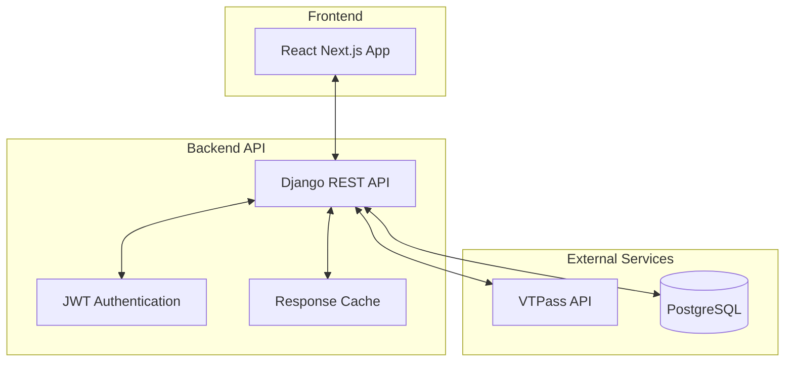
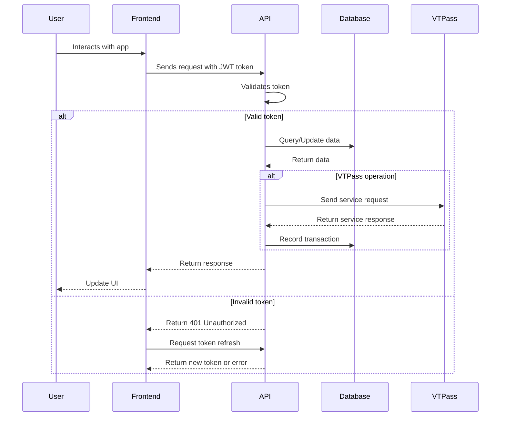
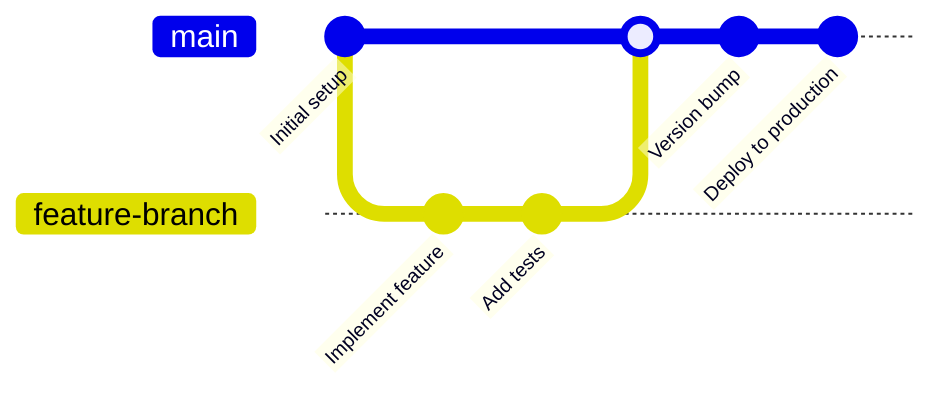

# PayLink Architecture Overview

This document provides a high-level overview of the PayLink system architecture, including system components, technology stack, and key design decisions.

## System Architecture

## Component Breakdown

### Frontend
- **Next.js React Application**: Provides the user interface for the PayLink service
- **Tailwind CSS**: Used for styling
- **Axios**: For API communication
- **React Context API**: For state management
- **JWT Handling**: Authentication token storage and refresh

### Backend
- **Django REST Framework**: Core API framework
- **Simple JWT**: JWT token authentication system
- **PostgreSQL**: Primary database
- **DRF Spectacular**: API documentation generation
- **CORS Middleware**: Cross-origin request handling
- **Whitenoise**: Static file serving for production

### External Services
- **VTPass API**: Integration for bill payments and airtime purchases
- **Render**: Hosting platform for deployment

## Data Flow Architecture

## Technology Stack

### Frontend
| Technology | Purpose | Version |
|------------|---------|---------|
| Next.js | React framework | 14+ |
| Tailwind CSS | UI styling | 3.3+ |
| TypeScript | Type safety | 5.0+ |
| Axios | HTTP client | 1.3+ |
| React Hook Form | Form handling | 7.43+ |
| Zod | Schema validation | 3.20+ |

### Backend
| Technology | Purpose | Version |
|------------|---------|---------|
| Python | Programming language | 3.11+ |
| Django | Web framework | 5.0+ |
| Django REST Framework | API framework | 3.14+ |
| Simple JWT | Authentication | 5.2+ |
| PostgreSQL | Database | 14+ |
| Gunicorn | WSGI server | 21+ |
| Whitenoise | Static file serving | 6.4+ |
| DRF Spectacular | API documentation | 0.26+ |

### DevOps
| Technology | Purpose |
|------------|---------|
| Git | Version control |
| GitHub | Repository hosting |
| Render | Cloud hosting |
| PostgreSQL (Render) | Database hosting |

## Key Design Decisions

### Backend Architecture

#### Django REST Framework
We chose Django REST Framework for its robust feature set, security, and rapid development capabilities. The framework provides:
- Built-in serialization system
- Comprehensive authentication options
- Powerful ORM for database operations
- Excellent documentation and community support

#### Authentication System
JWT (JSON Web Token) authentication was selected for:
- Stateless authentication
- Improved scalability
- Better performance compared to session-based auth
- Support for token refresh and blacklisting

#### Database Schema
PostgreSQL was chosen for:
- Advanced data types
- Robust transaction support
- Strong indexing capabilities
- Support for UUID primary keys

### API Design Principles

1. **RESTful Structure**
   - Resources are represented as URLs
   - HTTP methods match CRUD operations
   - Pagination for collection endpoints
   - Filtering and sorting capabilities

2. **Authentication & Authorization**
   - JWT for authentication
   - Permission-based access control
   - Token refresh mechanism
   - Token blacklisting on logout

3. **Error Handling**
   - Consistent error response format
   - Descriptive error messages
   - Appropriate HTTP status codes
   - Validation error details

### VTPass Integration

The VTPass integration follows these principles:

1. **Service Layer Abstraction**
   - VTPass API calls encapsulated in a service class
   - Clean separation of concerns
   - Error handling and retries
   - Response caching for performance

2. **Transaction Recording**
   - All VTPass operations recorded in the database
   - Transaction status tracking
   - Full response storage for audit purposes

3. **Error Recovery**
   - Graceful handling of API failures
   - Retry mechanisms for transient errors
   - Fallback responses when possible

## Scalability Considerations

### Current Architecture Capacity
- Supports hundreds of concurrent users
- Handles thousands of daily transactions
- Response time < 500ms for most operations

### Future Scaling Strategies
1. **Database Scaling**
   - Read replicas for query-heavy operations
   - Connection pooling optimization
   - Index optimization for common queries

2. **API Scaling**
   - Horizontal scaling with multiple API instances
   - Load balancing across instances
   - Caching frequently accessed data

3. **VTPass Integration Improvements**
   - Background processing for non-critical operations
   - Queue system for high-volume periods
   - Circuit breaker pattern for API stability

## Security Measures

1. **Authentication Security**
   - Short-lived access tokens (1 day)
   - Refresh token rotation
   - Token blacklisting on logout
   - HTTPS for all communications

2. **Data Protection**
   - Input validation and sanitization
   - Protection against common attacks (CSRF, XSS)
   - Environment variable configuration for sensitive data
   - No sensitive data in logs or error messages

3. **VTPass API Security**
   - API keys and secrets stored securely
   - No credentials in code or version control
   - Request signing for integrity
   - Limited permission scopes

## Development Workflow

1. **Feature Development**
   - Create feature branch from main
   - Implement and test feature
   - Open pull request with documentation

2. **Code Review Process**
   - Automated tests must pass
   - Code review by at least one team member
   - Documentation review

3. **Deployment**
   - Merge to main
   - Automated deployment to staging
   - Manual verification
   - Deployment to production 