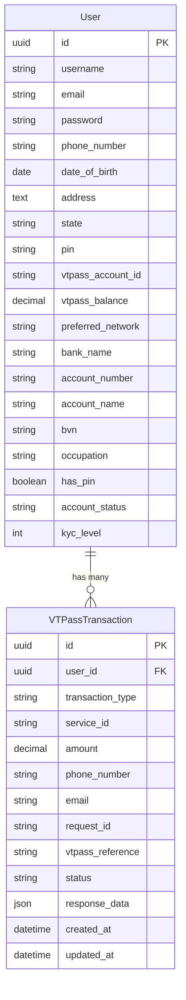

# PayLink Database Schema

## Entity Relationship Diagram

## Database Tables

### User

The `User` table extends Django's `AbstractUser` and stores information about registered users.

| Column Name | Type | Description |
|-------------|------|-------------|
| id | UUID | Primary key |
| username | VARCHAR | Django required username |
| email | VARCHAR | User's email address (unique, used for login) |
| password | VARCHAR | Hashed password |
| phone_number | VARCHAR | User's phone number |
| date_of_birth | DATE | User's date of birth |
| address | TEXT | User's address |
| state | VARCHAR | User's state of residence |
| pin | VARCHAR | Transaction PIN (6 digits max) |
| vtpass_account_id | VARCHAR | VTPass account identifier |
| vtpass_balance | DECIMAL | Current VTPass account balance |
| preferred_network | VARCHAR | User's preferred mobile network |
| bank_name | VARCHAR | User's bank name |
| account_number | VARCHAR | User's bank account number |
| account_name | VARCHAR | User's bank account name |
| bvn | VARCHAR | Bank Verification Number |
| occupation | VARCHAR | User's occupation |
| has_pin | BOOLEAN | Whether user has set a transaction PIN |
| account_status | VARCHAR | Account status (active, suspended, inactive) |

### VTPassTransaction

The `VTPassTransaction` table stores all transactions processed through the VTPass integration.

| Column Name | Type | Description |
|-------------|------|-------------|
| id | UUID | Primary key |
| user_id | UUID | Foreign key to User table |
| transaction_type | VARCHAR | Type of transaction (airtime, data, electricity, etc.) |
| service_id | VARCHAR | Service identifier from VTPass |
| amount | DECIMAL | Transaction amount |
| phone_number | VARCHAR | Recipient phone number (for applicable services) |
| email | VARCHAR | Email for receipt |
| request_id | VARCHAR | Unique VTPass request identifier |
| vtpass_reference | VARCHAR | VTPass reference for the transaction |
| status | VARCHAR | Transaction status (pending, successful, failed) |
| response_data | JSON | Complete response from VTPass API |
| created_at | DATETIME | When the transaction was created |
| updated_at | DATETIME | When the transaction was last updated |

## Relationships

1. **User to VTPassTransaction**: One-to-Many
   - A user can have multiple VTPass transactions
   - Each transaction belongs to exactly one user

## Data Flow

1. When a user registers, a record is created in the `User` table
2. When a user performs a transaction (e.g., buy airtime, pay electricity bill):
   - A record is created in the `VTPassTransaction` table
   - The transaction is initially marked as "pending"
   - After receiving confirmation from VTPass, the transaction status is updated

## KYC Levels

The system implements a simple KYC (Know Your Customer) level structure:
- **Level 1**: Basic registration
- **Level 2**: User has provided BVN (Bank Verification Number)

## Future Schema Extensions

The database schema can be extended to include:

1. **Wallet**: To store user wallet information
2. **Payment**: To track payment methods and history
3. **Beneficiary**: To store frequently used transaction recipients
4. **Notification**: To manage user notifications
5. **AuditLog**: To track all user activities for security purposes 