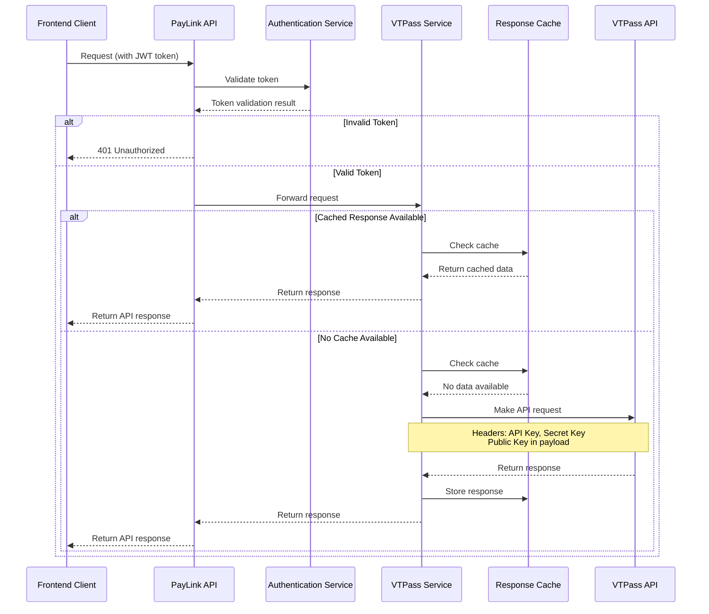
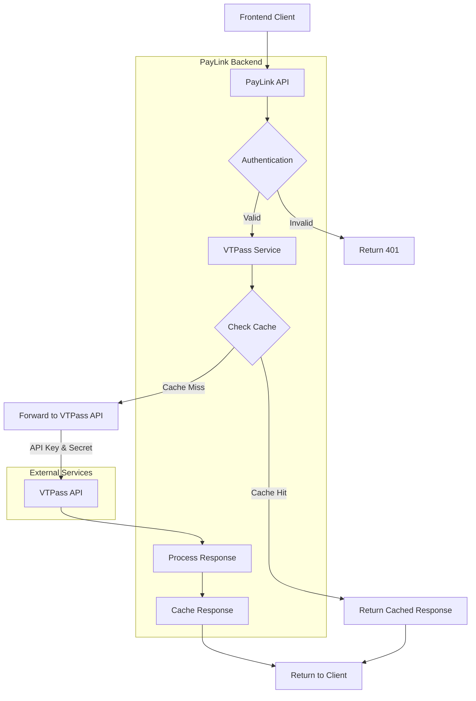

# VTPass API Integration Flow

## Sequence Diagram

## Flowchart Diagram

## Process Documentation

### Authentication Process
1. **Client Authentication**: Frontend authenticates with PayLink API using JWT
2. **VTPass Authentication**: Backend authenticates with VTPass using:
   - API Key (in headers)
   - Secret Key (in headers)
   - Public Key (in request payload when required)

### API Request Flow
1. Frontend makes request to PayLink API endpoint
2. API validates the user's JWT token
3. Request is forwarded to the VTPass service layer
4. Service layer checks for cached response
5. If no cache exists, the request is forwarded to VTPass API
6. Response is cached for future requests
7. Response is returned to client

### Supported VTPass Operations
- Airtime Purchase
- Data Bundle Purchase
- Electricity Bill Payment
- Cable TV Subscription
- Internet Service Payment
- Education Payments

### Error Handling
- Network errors are retried with exponential backoff
- Invalid parameters trigger validation errors
- Timeouts are handled gracefully with client notification
- All transactions are logged for audit purposes 